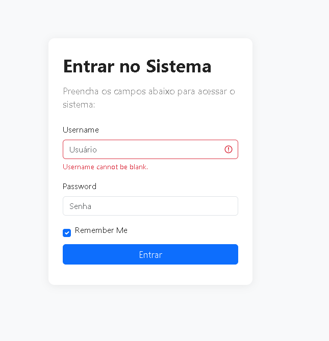
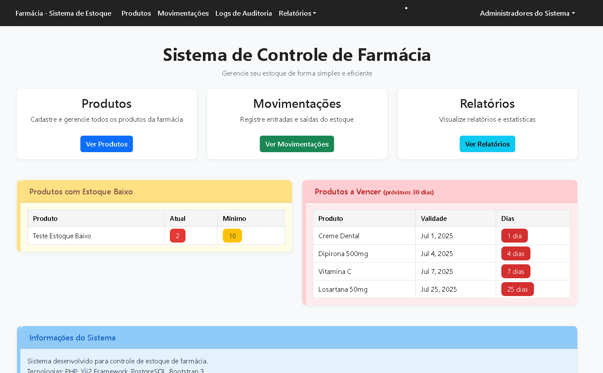
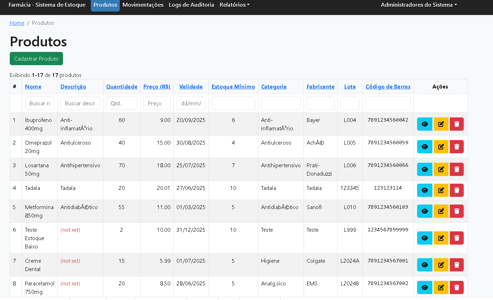
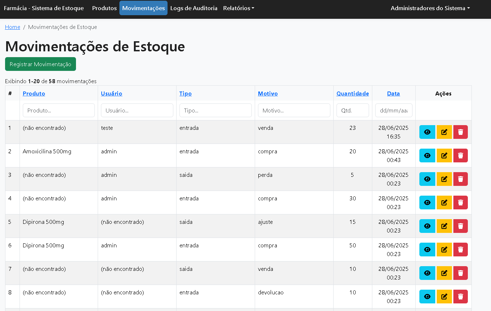
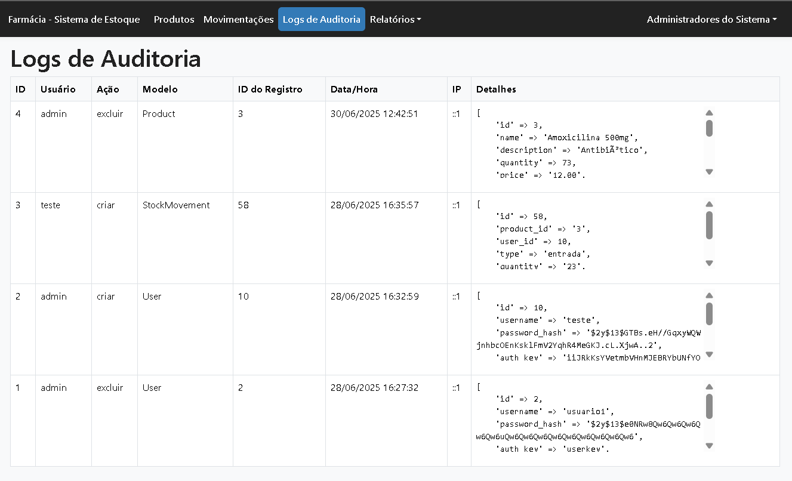
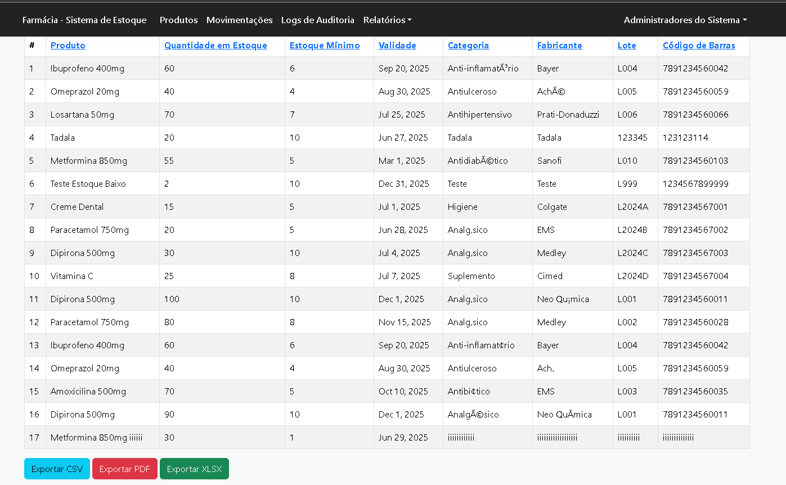
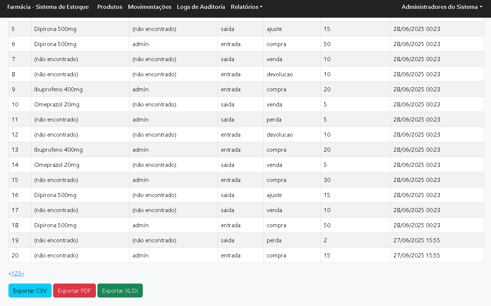
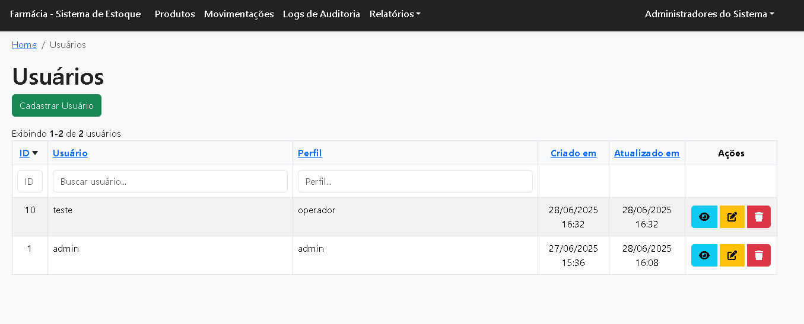

# Sistema de Estoque para Farmácia

<!--
Comentário feito por um aluno da 5ª fase de Ciência da Computação:
Este projeto é um sistema de controle de estoque para farmácias. Ele foi desenvolvido para ajudar a gerenciar produtos, movimentações de estoque, usuários e auditorias de ações no sistema. O objetivo é facilitar o controle de entrada e saída de produtos, evitando perdas e melhorando a organização.
-->

**Trabalho de MVC - Programação 3**  
Aluno: Wesley Lima  
Professor: Leandro Otavio Cordova Vieira  
Unoesc - 2024/1

---

## Descrição

Este projeto consiste em um sistema web de controle de estoque para farmácia, desenvolvido como trabalho acadêmico para a disciplina de Programação 3 (PHP/MVC) na Unoesc. O sistema permite o gerenciamento de produtos, movimentações de estoque, usuários e relatórios, com controle de permissões e logs de auditoria.

## Tecnologias Utilizadas
<!--
Aqui usamos o framework Yii2 (PHP), que é muito utilizado para criar aplicações web de forma rápida e organizada. Também utilizamos banco de dados relacional (MySQL ou MariaDB), HTML, CSS e um pouco de JavaScript para a interface.
-->

- **PHP (Yii2 Framework)**: Para a lógica do sistema e organização do código.
- **MySQL/MariaDB**: Para armazenar os dados dos produtos, usuários, movimentações, etc.
- **HTML/CSS/JS**: Para a parte visual do sistema.
- **Docker**: Para facilitar a configuração do ambiente de desenvolvimento.

## Funcionalidades Principais
<!--
O sistema permite cadastrar produtos, registrar movimentações de estoque (entrada e saída), cadastrar usuários com diferentes permissões e visualizar relatórios. Também existe um log de auditoria para registrar as ações importantes feitas pelos usuários.
-->

- Cadastro, edição e exclusão de produtos
- Controle de movimentações de estoque (entrada, saída, ajuste, devolução, etc.)
- Relatórios de estoque e movimentações (com exportação)
- Dashboard com alertas de estoque baixo e produtos a vencer
- Cadastro e gerenciamento de usuários com perfis (admin, gerente, operador)
- Logs de auditoria de todas as ações importantes
- Permissões avançadas por perfil de usuário
- Interface moderna, responsiva e totalmente em português

## Instalação e Execução

1. **Clone o repositório:**
   ```
   git clone <url-do-repositorio>
   cd farmacia-sistema-estoque
   ```
2. **Instale as dependências:**
   ```
   composer install
   ```
3. **Configure o banco de dados:**
   - Edite o arquivo `config/db.php` com os dados do seu PostgreSQL.
4. **Execute as migrations:**
   ```
   php yii migrate
   ```
5. **Inicie o servidor embutido:**
   ```
   php yii serve
   ```
   Ou configure o Apache/Nginx apontando para a pasta `web/`.

## Acesso ao Sistema
- **Usuário administrador padrão:**
  - Login: `admin`
  - Senha: `admin`
- Perfis disponíveis: admin, gerente, operador
- O sistema exige login para qualquer funcionalidade.

## Observações
<!--
Esse projeto é uma ótima base para aprender sobre desenvolvimento web, MVC, autenticação de usuários e integração com banco de dados. Qualquer dúvida, procure nos arquivos do projeto ou pergunte para o professor!
-->

---

**Desenvolvido para fins didáticos na Unoesc - Programação 3**

## Exemplos de Telas do Sistema

### Tela de Login


### Dashboard


### Listagem de Produtos


### Movimentações de Estoque


### Logs de Auditoria


### Relatório de Estoque


### Relatório de Movimentações


### Gestão de Usuários


---

## Passo a Passo para Rodar o Projeto em Outro Computador

### 1. Pré-requisitos
- **Git** instalado
- **Docker** e **Docker Compose** instalados
- (Opcional) **Composer** instalado, caso queira rodar sem Docker

### 2. Clonar o repositório
```bash
# Clone o projeto do GitHub
git clone https://github.com/seu-usuario/seu-repositorio.git
cd seu-repositorio
```

### 3. Configurar variáveis de ambiente (se necessário)
- Se existir um arquivo `.env.example`, copie para `.env` e ajuste as variáveis conforme seu ambiente.

### 4. Subir o ambiente com Docker
```bash
docker-compose up -d
```

### 5. Instalar dependências PHP (caso rode sem Docker)
```bash
composer install
```

### 6. Rodar as migrations para criar o banco de dados
```bash
# Usando Docker:
docker-compose exec app php yii migrate
# Ou localmente:
php yii migrate
```

### 7. Acessar o sistema
- Abra o navegador e acesse: [http://localhost:8080](http://localhost:8080)

### 8. Usuário padrão (se houver)
- Usuário: **admin**
- Senha: **admin**

### 9. Dicas e Solução de Problemas
- Se der erro de permissão, tente rodar o terminal como administrador.
- Se o banco não conectar, confira as variáveis de ambiente e se o container do banco está rodando.
- Para rodar testes, use:
  ```bash
  vendor/bin/codecept run
  ```
- Se precisar limpar arquivos temporários, apague as pastas `runtime/` e `web/assets/` (o Yii recria automaticamente).

---

## Observações
<!--
Esse projeto é uma ótima base para aprender sobre desenvolvimento web, MVC, autenticação de usuários e integração com banco de dados. Qualquer dúvida, procure nos arquivos do projeto ou pergunte para o professor!
-->
